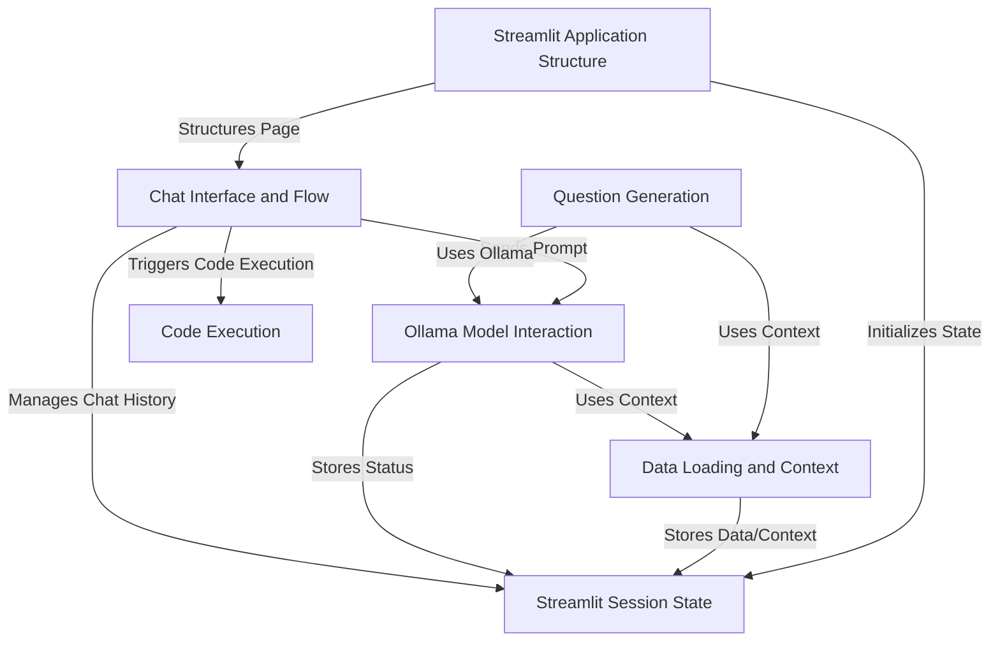

# Datars AI - Chatbot

This project is a **Streamlit application** that allows users to **upload CSV data** and then **chat with it** using an **Ollama AI model**.
It handles loading the data, understanding its structure, interacting with the AI to get answers or code, executing that code to display results or plots, and managing the chat conversation flow, even suggesting questions to get started.

## Visual Overview

## Chapters

1. [Streamlit Application Structure
](01_streamlit_application_structure_.md)
2. [Data Loading and Context
](02_data_loading_and_context_.md)
3. [Chat Interface and Flow
](03_chat_interface_and_flow_.md)
4. [Streamlit Session State
](04_streamlit_session_state_.md)
5. [Ollama Model Interaction
](05_ollama_model_interaction_.md)
6. [Code Execution
](06_code_execution_.md)
7. [Question Generation
](07_question_generation_.md)

---

