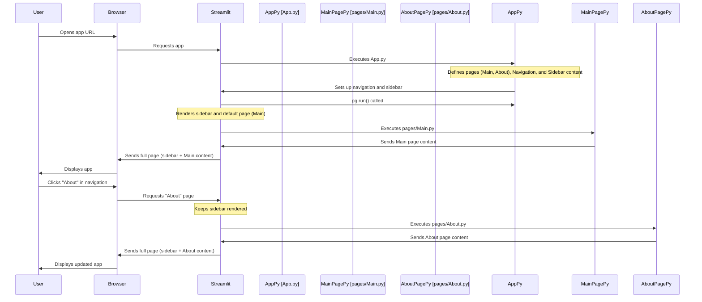

# Chapter 1: Streamlit Application Structure

Welcome to the first chapter of our tutorial series! Before we dive into the exciting AI parts of the `Python-AI-apps` project, we need to understand how the application is put together. Think of this chapter as looking at the **building plan** or the **skeleton** of our Streamlit app.

## What is Application Structure?

Imagine you're building a house. You need a plan that shows where the rooms are, where the walls go, and how you move from one room to another. In a web application, this "building plan" is the **application structure**. It defines:

1.  **Different "rooms" or pages:** Like a main area, an "About Us" page, etc.
2.  **Consistent elements:** Things that appear on every page, like a sidebar or a header/footer.
3.  **How to move between pages:** The navigation system.

For our DATARS-AI-Chatbot app, a key part of the structure is having a **Main page** where you interact with the AI and an **About page** to learn about the creator. We also need a **sidebar** that stays the same as you switch pages, holding things like the file uploader and support links.

Streamlit provides simple tools to create this structure, making it easy to organize your app's content.

## Pages and Navigation

In traditional web development, creating separate pages and navigation can be complicated. Streamlit makes it simple using `st.Page` and `st.navigation`.

Let's look at how our app defines its pages in the `App.py` file:

```python
# ... (other code like imports and session state setup) ...

# ---------------------------------------------------------------------------- #
#                                  Page Setup                                  #
# ---------------------------------------------------------------------------- #
HomePage = st.Page(page="pages/Main.py", icon=":material/spa:", title="Main", default=True)
AboutPage = st.Page(page="pages/About.py", icon=":material/person:", title="About")

pg = st.navigation([HomePage, AboutPage])

# ... (sidebar setup and pg.run() call) ...
```
*Code from `DATARS-AI-Chatbot/App.py`*

Here's what's happening line by line:

*   `HomePage = st.Page(...)`: We create an object representing our "Main" page.
    *   `page="pages/Main.py"`: This tells Streamlit that the content for this page lives in the file `pages/Main.py`.
    *   `icon=":material/spa:"`: This assigns a cool icon to the page in the navigation menu. Streamlit supports many icon sets!
    *   `title="Main"`: This is the name that will appear in the navigation menu.
    *   `default=True`: This makes "Main" the page that opens first when you run the app.
*   `AboutPage = st.Page(...)`: Similarly, we create an "About" page linked to the `pages/About.py` file.
*   `pg = st.navigation([HomePage, AboutPage])`: This is the core navigation setup. We create a navigation object `pg` and give it a list of all the pages (`[HomePage, AboutPage]`) it should manage.

After setting up the pages, a bit further down in `App.py` is the line that actually runs the navigation:

```python
# ... (page setup and sidebar setup) ...

pg.run()
# ------------------------------------ End ----------------------------------- #
```
*Code from `DATARS-AI-Chatbot/App.py`*

*   `pg.run()`: This command tells Streamlit to start the navigation system we just defined. Streamlit will then display the navigation menu (usually at the top or in the sidebar) and handle switching between the `Main.py` and `About.py` files when the user clicks on a page title.

So, `App.py` acts like the **director**. It decides which pages exist and how you navigate between them, but the actual content of each page comes from the separate files (`Main.py`, `About.py`).

## The Sidebar

Streamlit apps often have a sidebar for controls, information, or navigation. You can easily add content to the sidebar using `st.sidebar`.

Look at the `App.py` code again. Notice the section wrapped in `with st.sidebar:`:

```python
# ... (initial session state and ollama check) ...

with st.sidebar:
    file = st.file_uploader("Upload data", ["csv"])

    if file is not None:
        st.session_state["file_name"] = file.name
        import pandas as pd # Note: Imports are often done at the top
        st.session_state["df"] = pd.read_csv(file)

# ... (more session state setup) ...

# ... (Page Setup) ...

st.logo(logo_gif, size="large") # This logo appears in the sidebar because it's before pg.run()
with st.sidebar: # Content inside this block goes to the sidebar
    st.markdown(8 * "<br>", unsafe_allow_html=True)
    st.caption("Support me by clicking on this button 👇")
    button(username=coffee_username, floating=False, width=221)
    st.caption(version)

pg.run()
```
*Code from `DATARS-AI-Chatbot/App.py` (simplified)*

Everything placed inside a `with st.sidebar:` block will appear in the app's sidebar, regardless of which page (`Main.py` or `About.py`) is currently displayed in the main area.

In our app's sidebar, you'll find:
*   A file uploader (`st.file_uploader`).
*   A logo (`st.logo`).
*   A "Buy Me a Coffee" button (`button` from `streamlit_extras`).
*   The app version (`st.caption`).

This shows how `App.py` handles the overall layout, including the persistent sidebar elements, while the page files handle the main content area.

## What's Inside the Page Files?

Since `App.py` only defines *which* files are pages, what do those page files (`pages/Main.py` and `pages/About.py`) look like? They contain the specific Streamlit code for that page's content.

Here's a *very simplified* idea of what's inside `pages/About.py` (we'll see the full code later):

```python
# --- File: DATARS-AI-Chatbot/pages/About.py ---
import streamlit as st

# ... (Custom CSS and image links) ...

st.markdown("<h1>Sarvamm</h1>", unsafe_allow_html=True) # Page title
st.markdown('<p class="subtitle">...</p>', unsafe_allow_html=True) # Subtitle

# ... (More content: About text, social links, coffee button using components) ...

# ... (Footer) ...
```
*Simplified Code from `DATARS-AI-Chatbot/pages/About.py`*

And a *very simplified* idea of `pages/Main.py`:

```python
# --- File: DATARS-AI-Chatbot/pages/Main.py ---
import streamlit as st

st.title("DATARS - AI") # Main page title

# ... (Logic for checking data, displaying chat, etc.) ...

# This file contains the core chat interface and AI interaction logic
```
*Simplified Code from `DATARS-AI-Chatbot/pages/Main.py`*

When you are on the "About" page, Streamlit runs the code in `pages/About.py` to display the content in the main area. When you switch to the "Main" page, Streamlit runs the code in `pages/Main.py`. The sidebar content defined in `App.py` remains visible throughout.

## How It Works: A Simple Flow

Let's visualize the basic flow when the app starts and you switch pages.



This diagram shows that `App.py` is the starting point that sets up the overall structure and navigation. Streamlit then loads and runs the specific page file (`Main.py` or `About.py`) based on which page is selected by the user, while keeping the sidebar elements from `App.py` visible.

## Summary

In this chapter, we learned about the basic structure of our Streamlit application:

*   **`App.py`:** Acts as the central director. It defines the different pages using `st.Page`, sets up the navigation menu with `st.navigation`, and includes persistent elements like the sidebar using `st.sidebar`.
*   **Page Files (e.g., `pages/Main.py`, `pages/About.py`):** These files contain the specific Streamlit code and content that appears in the main area of the app when that page is active.

Understanding this structure is fundamental. Now that we know how the different parts of the app are organized, we can start looking at how the app actually loads and uses data.

Let's move on to the next chapter to explore [Data Loading and Context](02_data_loading_and_context_.md).

---