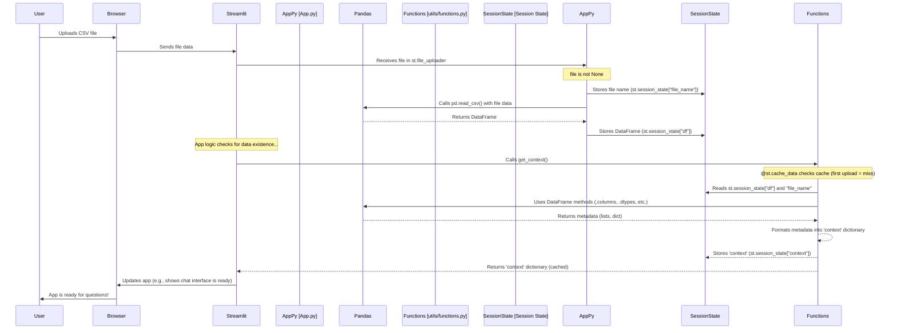

# Chapter 2: Data Loading and Context

Welcome back! In [Chapter 1: Streamlit Application Structure](01_streamlit_application_structure_.md), we learned how our app is organized using Streamlit pages and the sidebar. We saw where the file uploader lives (in the sidebar) and how `App.py` acts as the director.

Now, let's get to the core of what makes this app useful for data analysis: handling the user's data! This chapter is all about taking that uploaded file and making it ready for the AI to understand and work with.

## What's the Problem?

Imagine the AI model is a super-smart data analyst, but it's blind. It can't just *see* the CSV file you upload. We need to do two main things:

1.  **Load the Data:** Get the raw information from the CSV file into a structured format that Python and data analysis libraries (like Pandas) can easily use. Think of this as taking a physical book (the CSV file) and transcribing all the words into a computer document (a Pandas DataFrame).
2.  **Provide Context:** Tell the AI *about* the data. What are the column names? Are they numbers or text? What kind of information is in each column? This is like giving the analyst a summary of the book's chapters, character list, and index before they start reading. This "context" helps the AI understand what kind of questions it can answer and how to approach the data.

This chapter focuses on how our app accomplishes these two crucial steps.

## Key Concepts

To solve this, we'll use two main ideas:

*   **Pandas DataFrames:** A powerful tool in Python for working with structured data like tables (perfect for CSV files).
*   **Data Context:** A summary of the key characteristics of the DataFrame (column names, data types, etc.) stored in a simple format.

Let's see how the app implements these.

## Loading the Data with Streamlit and Pandas

Remember the file uploader we saw in the sidebar in [Chapter 1: Streamlit Application Structure](01_streamlit_application_structure_.md)? That's where it all starts!

Here's the relevant part of the code from `App.py`:

```python
# --- File: DATARS-AI-Chatbot/App.py ---
# ... (imports and initial session state setup) ...

with st.sidebar:
    # Create a file uploader widget
    file = st.file_uploader("Upload data", ["csv"])

    # Check if a file has been uploaded
    if file is not None:
        # Store the original file name
        st.session_state["file_name"] = file.name
        # Import pandas (often imported at top, but shown here for context)
        import pandas as pd
        # Read the CSV file into a pandas DataFrame
        st.session_state["df"] = pd.read_csv(file)

# ... (more session state setup and page navigation) ...
```
*Code from `DATARS-AI-Chatbot/App.py` (simplified)*

Here's a breakdown:

1.  `with st.sidebar:`: As we learned, anything inside this block goes into the sidebar.
2.  `file = st.file_uploader("Upload data", ["csv"])`: This creates the file uploader widget. It shows the label "Upload data" and only accepts files with the ".csv" extension. When a user uploads a file, this line returns a `file` object containing the file's data. If no file is uploaded yet, it returns `None`.
3.  `if file is not None:`: This block of code only runs *after* the user has successfully uploaded a file.
4.  `st.session_state["file_name"] = file.name`: We store the name of the uploaded file in [Streamlit Session State](04_streamlit_session_state_.md). This lets us remember the file name across different interactions.
5.  `import pandas as pd`: This line imports the Pandas library, giving it the common alias `pd`. We need Pandas to read the CSV data.
6.  `st.session_state["df"] = pd.read_csv(file)`: This is the magic! `pd.read_csv()` takes the uploaded `file` object and reads its content, turning it into a structured table called a Pandas DataFrame. This DataFrame is then stored in [Streamlit Session State](04_streamlit_session_state_.md) under the key `"df"`. Storing it in session state is crucial because it means the data persists even when the user interacts with other parts of the app (more on this in [Chapter 4: Streamlit Session State](04_streamlit_session_state_.md)).

After these steps, the user's data is no longer just a file; it's a usable Pandas DataFrame (`st.session_state["df"]`) ready for analysis.

## Extracting the Data Context

Now that we have the data in a DataFrame, we need to get that summary information ("context") for the AI. This context includes things like:

*   What are the names of all the columns?
*   Which columns contain numbers (numerical)?
*   Which columns contain text or categories (categorical)?
*   What is the specific data type for each column (integer, float, string, etc.)?

This information is extracted by a dedicated function called `get_context` located in the `utils/functions.py` file.

Here's the code for the `get_context` function:

```python
# --- File: DATARS-AI-Chatbot/utils/functions.py ---
# ... (other imports and functions) ...

@st.cache_data # This is a Streamlit caching decorator
def get_context() -> dict:
    """
    Retrieve and cache the context information of a DataFrame.
    Extracts column names, numerical/categorical split, and data types.
    Returns: A dictionary with context info.
    """
    # Get the DataFrame and file name from session state
    df = st.session_state["df"]
    file_name = st.session_state["file_name"]

    # Extract information using pandas methods
    columns = str(df.columns.tolist()) # Get column names as a list, convert to string
    numerical_columns = str(df.select_dtypes(include=["number"]).columns.tolist()) # Get numerical columns
    categorical_columns = str(df.select_dtypes(exclude=["number"]).columns.tolist()) # Get non-numerical columns
    dtypes = str(df.dtypes.to_dict()) # Get data types as a dictionary, convert to string

    # Package the information into a dictionary
    context = {
        "file_name": file_name,
        "columns": columns,
        "numerical_columns": numerical_columns,
        "categorical_columns": categorical_columns,
        "dtypes": dtypes,
    }
    return context # Return the context dictionary

# ... (other functions) ...
```
*Code from `DATARS-AI-Chatbot/utils/functions.py` (simplified)*

Let's break down how this function gets the context:

1.  `@st.cache_data`: This is a Streamlit feature that memorizes the result of the function based on its inputs. Since `get_context` only relies on `st.session_state["df"]` and `st.session_state["file_name"]` (which change only when a new file is uploaded), Streamlit will run this function only once per uploaded file. If you upload the same file again or interact with the app in ways that don't change the data, the cached result is used, making the app faster!
2.  `df = st.session_state["df"]` and `file_name = st.session_state["file_name"]`: The function accesses the DataFrame and file name that were stored in [Streamlit Session State](04_streamlit_session_state_.md) during the data loading step.
3.  `df.columns.tolist()`: This is a Pandas DataFrame method that returns a list of all the column names. `str(...)` converts that list into a string format suitable for sending to the AI prompt later.
4.  `df.select_dtypes(include=["number"]).columns.tolist()`: This selects *only* the columns that have a numerical data type and then gets their names as a list.
5.  `df.select_dtypes(exclude=["number"]).columns.tolist()`: This selects columns that are *not* numerical (usually text or categories) and gets their names.
6.  `df.dtypes.to_dict()`: This gets the data type for *each* column and puts it into a dictionary where keys are column names and values are data types.
7.  `context = {...}`: All the extracted information is organized into a Python dictionary.
8.  `return context`: The function returns this context dictionary.

This `context` dictionary (`st.session_state["context"]` in `App.py`) contains all the essential metadata about the user's uploaded data, formatted in a way that can be easily included in the prompt sent to the AI model.

## How it Works: The Data Flow

Let's put it together and see the simple flow when a user uploads a CSV file.



This diagram shows the sequence: the file upload triggers loading into a DataFrame and then the extraction of context information, both stored in the persistent [Streamlit Session State](04_streamlit_session_state_.md).

## Where is Context Used?

The `context` dictionary isn't displayed directly to the user (though you could add Streamlit elements to do that!). Its primary purpose is to be included in the *prompt* that gets sent to the AI model.

Look closely at the `get_ollama_stream` function in `utils/functions.py` (we'll cover [Ollama Model Interaction](05_ollama_model_interaction_.md) in detail later). You'll see the context is embedded directly into the instruction prompt:

```python
# --- File: DATARS-AI-Chatbot/utils/functions.py ---
# ... (other functions) ...

def get_ollama_stream(
    user_prompt: str, model: str = "qwen2.5-coder:7b"
) -> Generator[str, None, None]:
    # ... (function definition) ...

    # Constructing the prompt for the AI
    prompt = f'''You are a data analyst assistant working on a with the following columns:
{st.session_state['context']['columns']} # Using columns from context

Out of which, numerical columns are:
{st.session_state['context']['numerical_columns']} # Using numerical columns from context

and Categorical columns are:
{st.session_state['context']['categorical_columns']} # Using categorical columns from context

columns data types are:
{st.session_state['context']['dtypes']} # Using dtypes from context

The data frame is loaded in the variable df.
You will be provided a question related to the data frame.
Your task is to answer the question using Python code.
First decide whether the question requires a plot or not.
- If yes, plot it using Plotly Express in Streamlit.
- If no, use pandas methods and display answers using st.write().
Use single quotes for st.write().
Respond only with executable Python code blocks that can run inside exec().
Question:
{user_prompt}'''

    # ... (ollama chat call) ...
```
*Code from `DATARS-AI-Chatbot/utils/functions.py` (simplified)*

By including the `context` information directly in the prompt, we give the AI model the necessary background about the dataset *before* it even tries to answer a question or generate code. This makes the AI's responses much more relevant and accurate for the specific data provided by the user.

## Summary

In this chapter, we learned how our app handles the user's data:

*   We use Streamlit's `st.file_uploader` to allow users to upload CSV files.
*   The powerful Pandas library (`pd.read_csv`) is used to transform the uploaded CSV data into a structured DataFrame, which is stored in [Streamlit Session State](04_streamlit_session_state_.md) (`st.session_state["df"]`).
*   A dedicated function, `get_context`, extracts key metadata about the DataFrame (column names, types, etc.) using Pandas methods.
*   This extracted context is also stored in [Streamlit Session State](04_streamlit_session_state_.md) (`st.session_state["context"]`) and is crucial for informing the AI model about the data it needs to work with.
*   Streamlit's `@st.cache_data` helps optimize the context extraction process.

Now that the data is loaded and we have the necessary context, we can start thinking about how the user will interact with the AI. In the next chapter, we'll explore the [Chat Interface and Flow](03_chat_interface_and_flow_.md).

---