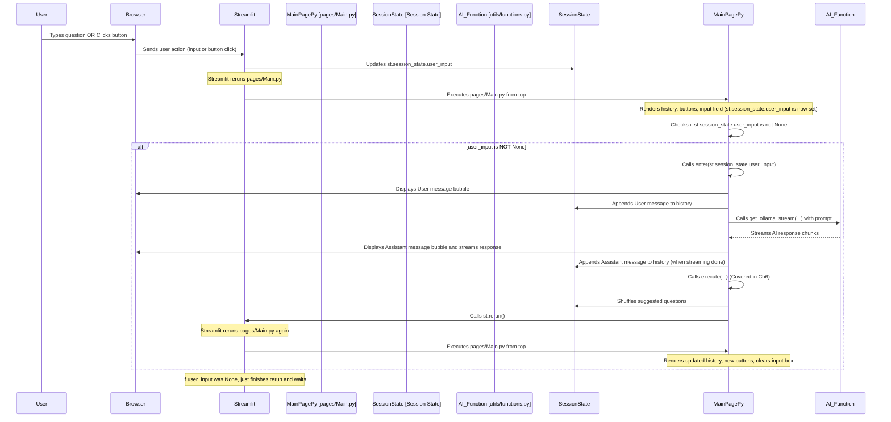

# Chapter 3: Chat Interface and Flow

Welcome back! In [Chapter 1: Streamlit Application Structure](01_streamlit_application_structure_.md), we learned how our app is organized into pages and a sidebar. In [Chapter 2: Data Loading and Context](02_data_loading_and_context_.md), we saw how the user's data is uploaded, loaded into a Pandas DataFrame, and how important context about the data is extracted.

Now, we have the data ready and waiting in the background. How does the user actually *talk* to the AI about this data? This is where the **Chat Interface and Flow** comes in.

## What is the Chat Interface and Flow?

Think about your favorite messaging app. It has:

1.  A history of past messages.
2.  A place to type new messages.
3.  Maybe some quick-reply suggestions.
4.  When you send a message, it appears in the history, and you wait for a reply.

Our app's chat interface for the data analysis AI works exactly like this! It's the main area on the "Main" page ([pages/Main.py](pages/Main.py)) where:

*   You see the conversation history with the AI.
*   Buttons offer easy ways to ask common questions.
*   You can type your own specific questions.
*   When you send a question, the app processes it, sends it to the AI, displays the AI's answer (which often includes code or charts!), and adds the interaction to the history.

This chapter will walk you through the simple Streamlit components used to build this interface and the basic flow that happens when you ask a question.

## Showing the Conversation History

To display the chat history, we need two things:

1.  A way to **store** the messages so they don't disappear every time something happens in the app (like typing). We'll use [Streamlit Session State](04_streamlit_session_state_.md) for this.
2.  Streamlit components to **display** each message nicely, showing who sent it (user or assistant).

First, let's set up where to store the messages in [Streamlit Session State](04_streamlit_session_state_.md). We do this at the beginning of the `pages/Main.py` file:

```python
# --- File: DATARS-AI-Chatbot/pages/Main.py ---
# ... (imports and status checks) ...

# Create a session state variable to store the chat messages.
# This ensures that the messages persist across reruns.
if "messages" not in st.session_state:
    st.session_state.messages = []
if "user_input" not in st.session_state:
    st.session_state.user_input = None

# ... (Rest of the page code) ...
```
*Code from `DATARS-AI-Chatbot/pages/Main.py` (simplified)*

*   `if "messages" not in st.session_state:`: This checks if a variable named `messages` already exists in [Streamlit Session State](04_streamlit_session_state_.md).
*   `st.session_state.messages = []`: If it doesn't exist (meaning this is the first time the page is run), we initialize it as an empty list. This list will hold all our chat messages.
*   `if "user_input" not in st.session_state:` and `st.session_state.user_input = None`: We also initialize a `user_input` variable, which we'll use shortly to temporarily store the user's *new* question before it's processed.

Next, we need to loop through the `st.session_state.messages` list and display each message:

```python
# --- File: DATARS-AI-Chatbot/pages/Main.py ---
# ... (imports, status checks, session state setup) ...

# Display the existing chat messages
for message in st.session_state.messages:
    if message["role"] == "user":
        with st.chat_message("user"):
            st.markdown(message["content"])
    if message["role"] == "assistant":
        with st.chat_message("assistant"):
            with st.expander("Show Code"):
                st.markdown(message["content"])
            con = st.container(border=True)
            with con:
                # This executes the code provided by the AI
                # Covered in detail in Chapter 6
                execute(message["content"])

# ... (Rest of the page code) ...
```
*Code from `DATARS-AI-Chatbot/pages/Main.py` (simplified)*

*   `for message in st.session_state.messages:`: We go through each item in our list of messages.
*   Each `message` in the list is a dictionary, typically looking like `{"role": "user", "content": "Hello!"}` or `{"role": "assistant", "content": "```python\nprint('Hi')\n```"}`. The `"role"` tells us who sent it, and `"content"` is the message text.
*   `with st.chat_message("user"):` and `with st.chat_message("assistant"):`: These Streamlit *context managers* create the visual chat bubbles. Anything you put inside the `with` block will appear within that message bubble, styled appropriately for a user or assistant message.
*   `st.markdown(message["content"])`: We use `st.markdown` to display the message content. This is great because it correctly renders things like bold text, bullet points, and importantly, code blocks (` ```python ... ``` `).
*   The section for the assistant message also includes `st.expander("Show Code")` and a call to `execute(message["content"])`. The expander lets you hide/show the AI's raw code response. The `execute` function actually *runs* that code (like generating a chart or printing a result). We'll dive deeper into how this code execution works in [Chapter 6: Code Execution](06_code_execution_.md). For now, just know that the AI's response often contains code that needs to be run to produce the final output seen by the user.

By looping through the `messages` list and using `st.chat_message`, we rebuild the entire conversation history every time the page reruns, making it look like a continuous chat.

## Suggested Questions (Buttons)

To make it easy for beginners, the app provides buttons with pre-written questions. These are displayed above the chat input area.

This functionality is handled by the `render_buttons` function:

```python
# --- File: DATARS-AI-Chatbot/pages/Main.py ---
# ... (imports, status checks, session state setup, history display) ...

st.divider() # Adds a horizontal line

# ------------------------- Render suggestion buttons ------------------------ #
def render_buttons() -> None:
    """
    Function to render the three question buttons above the chat input
    """
    # Get the first 3 questions from the shuffled list
    q1, q2, q3 = st.session_state["questions"][:3]

    # Create three columns for the buttons
    left, mid, right = st.columns([1, 1, 1])

    # Create a button in each column
    if left.button(q1, key=f"left_{q1}"):
        # If clicked, set the user_input session state
        st.session_state.user_input = q1
    if mid.button(q2, key=f"mid_{q2}"):
        st.session_state.user_input = q2
    if right.button(q3, key=f"right_{q3}"):
        st.session_state.user_input = q3
    return None

# Call the function to display the buttons
render_buttons()

# ... (Rest of the page code) ...
```
*Code from `DATARS-AI-Chatbot/pages/Main.py` (simplified)*

*   `st.divider()`: Adds a visual separator.
*   `def render_buttons():`: Defines a function to keep this logic organized.
*   `q1, q2, q3 = st.session_state["questions"][:3]`: This takes the first three questions from a list of pre-generated questions stored in `st.session_state["questions"]`. Where do these questions come from? A function called `get_questions` which we'll explain in [Chapter 7: Question Generation](07_question_generation_.md)!
*   `left, mid, right = st.columns([1, 1, 1])`: Streamlit's `st.columns` allows you to place elements side-by-side. We create three columns of equal width.
*   `left.button(q1, key=f"left_{q1}")`: This creates a button inside the `left` column. The button displays the text of question `q1`. The `key` is important because Streamlit needs a unique identifier for each widget, especially when they are generated dynamically or multiple times.
*   `if left.button(q1, ...):`: When a Streamlit button is clicked, the app reruns, and the `st.button` function returns `True` for the button that was clicked in that rerun.
*   `st.session_state.user_input = q1`: If the button is clicked (`if` condition is true), we take the text of the question from the button (`q1`) and store it in our temporary holding variable `st.session_state.user_input`. This is the same variable that the main chat input uses!

So, clicking a suggested question button is programmatically the same as typing that question into the chat box and pressing Enter – it puts the question text into `st.session_state.user_input` and triggers the chat processing flow.

## Capturing User Input

The primary way for the user to ask a question is the chat input box at the bottom of the screen.

```python
# --- File: DATARS-AI-Chatbot/pages/Main.py ---
# ... (imports, status checks, session state, history, buttons) ...

# Create a chat input field for the user to enter a message.
chat_box_input = st.chat_input("Ask your question")

# If the user typed something and pressed Enter...
if chat_box_input is not None:
    # Store their input in the user_input session state variable
    st.session_state.user_input = chat_box_input

# ... (Code that processes the user_input) ...
```
*Code from `DATARS-AI-Chatbot/pages/Main.py` (simplified)*

*   `chat_box_input = st.chat_input("Ask your question")`: This is the Streamlit component that creates the interactive input box at the bottom. The string "Ask your question" is the placeholder text. When the user types something and presses Enter (or the send icon), the app reruns, and `st.chat_input` returns the text the user entered. If nothing was entered in that rerun, it returns `None`.
*   `if chat_box_input is not None:`: This checks if the user actually typed something and submitted it.
*   `st.session_state.user_input = chat_box_input`: If they did, we store their typed question in the same `st.session_state.user_input` variable used by the buttons.

This is the mechanism for getting the user's new question into a variable that the rest of the code can check.

## The Chat Flow: From Question to Answer

Now that we know how to show history, suggest questions, and get new input, how does it all trigger the AI and display the response? This is the core "flow".

The key idea is that *both* clicking a button and typing in the chat box end up setting `st.session_state.user_input` to the question text and triggering a Streamlit rerun.

After the history, buttons, and chat input are defined in `pages/Main.py`, there's a block of code that *checks* if `st.session_state.user_input` has been set (meaning a new question was just provided by the user or a button click). If it has, it calls a function, let's call it `enter`, to handle the entire processing sequence.

Let's visualize this core flow using a sequence diagram:



This diagram shows how any user interaction that provides a question (typing or button) triggers a specific sequence: updating session state, rerunning the script, checking for the new input, calling a processing function (`enter`), displaying messages, getting the AI response, and finally, rerunning *again* to clear the input box and show the final state.

## The Processing Logic (`enter` function)

The core logic that runs when a new question is detected is encapsulated in the `enter` function:

```python
# --- File: DATARS-AI-Chatbot/pages/Main.py ---
# ... (imports, status checks, session state, history, buttons, chat input setup) ...

def enter(prompt):
    """
    Processes the user's prompt, interacts with the AI,
    displays the chat, and executes code.
    """
    if isinstance(prompt, str) and prompt: # Ensure prompt is a non-empty string
        # 1. Display user message immediately
        with st.chat_message("user"):
            st.markdown(prompt)
        # 2. Add user message to history
        st.session_state.messages.append({"role": "user", "content": prompt})

        # 3. Get stream from AI model (see Chapter 5)
        stream = get_ollama_stream(prompt)

        # 4. Display assistant message and stream response
        with st.chat_message("assistant"):
            # st.write_stream displays the response chunk by chunk
            response = st.write_stream(stream)
        # 5. Add assistant message to history (full response after streaming)
        st.session_state.messages.append({"role": "assistant", "content": response})

        # 6. Execute the code from the assistant response (see Chapter 6)
        con = st.container(border=True)
        with con:
            execute(response)

        # 7. Prepare for the next turn
        st.session_state.user_input = None # Clear temporary input
        rd.shuffle(st.session_state.questions) # Shuffle suggested questions
        st.rerun() # Force a rerun to update the interface

# This is the crucial part that triggers the flow
# Checks if st.session_state.user_input was set by the chat input or buttons
if st.session_state.user_input is not None:
    enter(st.session_state.user_input)

# Note: The line below might look redundant, but ensures user_input is cleared
# if the enter function was NOT called in this rerun.
st.session_state.user_input = None

# ... (Else block for no data uploaded) ...
```
*Code from `DATARS-AI-Chatbot/pages/Main.py` (simplified)*

Here's what happens step-by-step inside the `enter` function:

1.  **Display User Message:** It immediately shows the user's question in a user-styled chat bubble using `st.chat_message("user")` and `st.markdown`.
2.  **Add to History:** The user's message is added as a dictionary `{"role": "user", "content": prompt}` to the `st.session_state.messages` list.
3.  **Get AI Stream:** It calls `get_ollama_stream(prompt)`, which sends the user's question (along with the data context from [Chapter 2](02_data_loading_and_context_.md)) to the AI model and gets back a *stream* of the response. We'll cover `get_ollama_stream` in [Chapter 5: Ollama Model Interaction](05_ollama_model_interaction_.md).
4.  **Display Assistant Message (Streaming):** It starts a new assistant chat bubble `st.chat_message("assistant")`. Instead of waiting for the whole response, `st.write_stream(stream)` displays the AI's response *as it's being generated*, character by character or chunk by chunk. This makes the app feel more responsive. `st.write_stream` returns the *complete* response once the stream is finished.
5.  **Add to History:** The *complete* AI response (which includes the code block) is then added to `st.session_state.messages` as `{"role": "assistant", "content": response}`.
6.  **Execute Code:** It calls `execute(response)`. This function is responsible for extracting the Python code from the AI's response and running it. This is how charts appear or calculations are displayed below the AI's text explanation. We'll learn all about this in [Chapter 6: Code Execution](06_code_execution_.md).
7.  **Prepare for Next Turn:**
    *   `st.session_state.user_input = None`: The temporary `user_input` variable is cleared, so the same question isn't processed again on the next rerun.
    *   `rd.shuffle(st.session_state.questions)`: The list of suggested questions is shuffled to present different options next time.
    *   `st.rerun()`: This is a powerful Streamlit command that forces the script to rerun *immediately* from the top. This is needed to:
        *   Clear the `st.chat_input` box visually.
        *   Display the newly added messages (both user and assistant) from the updated `st.session_state.messages`.
        *   Render the newly shuffled suggested question buttons.

After the `enter` function definition, the line `if st.session_state.user_input is not None: enter(st.session_state.user_input)` is what actually *calls* the `enter` function if a new question was just provided. The final `st.session_state.user_input = None` ensures that if a rerun happened for *another* reason (not a new user input), the `user_input` variable is still cleared, preventing accidental processing.

## What if No Data is Uploaded?

Remember from [Chapter 2](02_data_loading_and_context_.md) that the core functionality requires data (`st.session_state["df"]` to be not `None`). The entire chat interface section in `pages/Main.py` is wrapped in a check for this:

```python
# --- File: DATARS-AI-Chatbot/pages/Main.py ---
# ... (imports) ...

st.title("DATARS - AI")

# Check if data has been loaded
if st.session_state["df"] is not None:
    # --- All the chat interface code goes here ---
    # status checks, session state setup, history display, render_buttons(),
    # st.chat_input(), enter() function definition,
    # and the line calling enter() based on st.session_state.user_input
    pass # Placeholder for the code shown above
else:
    # --- Content displayed when no data is loaded ---
    st.markdown(...) # Informational text
    st.warning("Upload a file to get started.")

# ------------------------------------ End ----------------------------------- #
```
*Code from `DATARS-AI-Chatbot/pages/Main.py` (simplified structure)*

If `st.session_state["df"]` is `None`, the `else` block is executed, showing the user instructions on how to get started by uploading a file, and the entire chat interface code is skipped.

## Summary

In this chapter, we explored the heart of the user interaction: the chat interface and the flow of a conversation turn:

*   We use [Streamlit Session State](04_streamlit_session_state_.md) (`st.session_state.messages`) to store the conversation history persistently across reruns.
*   `st.chat_message` is used in a loop to display each message in the history with the correct styling.
*   `st.columns` and `st.button` create suggested question buttons that set a `user_input` state variable when clicked.
*   `st.chat_input` provides the main text box for users to type questions, also setting the `user_input` state variable.
*   The core chat flow is triggered by checking if `st.session_state.user_input` is set. If it is, a processing function (`enter`) is called.
*   The `enter` function handles displaying the user message, calling the AI (`get_ollama_stream`), streaming and displaying the AI response (`st.write_stream`), executing any code in the response (`execute`), and finally forcing a rerun (`st.rerun()`) to update the interface.
*   The entire chat interface is only displayed if data has been successfully uploaded, otherwise, instructions are shown.

We've touched upon [Streamlit Session State](04_streamlit_session_state_.md) repeatedly in this chapter as the key to making the chat history and temporary input persist. Let's dedicate the next chapter to understanding [Streamlit Session State](04_streamlit_session_state_.md) in more detail.

[Chapter 4: Streamlit Session State](04_streamlit_session_state_.md)

---