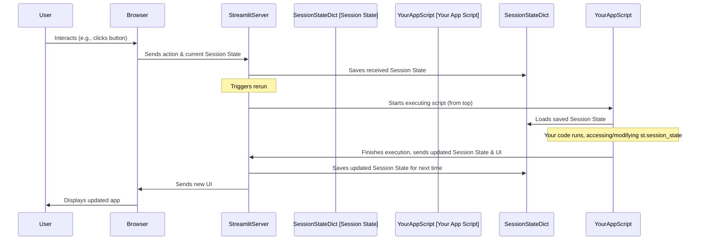

# Chapter 4: Streamlit Session State

Welcome back! In our journey through the `Python-AI-apps` project, we've covered the [Streamlit Application Structure](01_streamlit_application_structure_.md) (Chapter 1), how we handle [Data Loading and Context](02_data_loading_and_context_.md) (Chapter 2), and the core of the user interaction with the [Chat Interface and Flow](03_chat_interface_and_flow_.md) (Chapter 3).

You might have noticed in the code snippets from the last two chapters that we kept using something called `st.session_state`. We stored the uploaded DataFrame (`st.session_state["df"]`), the chat messages (`st.session_state.messages`), the temporary user input (`st.session_state.user_input`), and more using this `st.session_state` object. But why?

This chapter is dedicated to understanding this crucial concept: **Streamlit Session State**.

## What Problem Does Session State Solve?

Imagine you're building a simple web app with Streamlit. When a user interacts with your app – maybe they type something in a text box, click a button, or upload a file – Streamlit's core behavior is to **rerun** your Python script from top to bottom.

Think of it like pressing the refresh button on your web browser *every time* something happens.

```python
# Simple example - will not work as expected
import streamlit as st

# Let's try to count button clicks without session state
if 'count' not in locals():
    count = 0 # Initialize count

st.write(f"Current count: {count}")

if st.button("Click me!"):
    count += 1 # Increment count
    # When the button is clicked, the script reruns.
    # On rerun, 'count' is reset to 0 because 'count' is a local variable.

```

If you ran the simple code above, you'd see "Current count: 0" even after clicking the button many times. Why? Because each button click triggers a rerun, and on each rerun, the script starts from the top, re-initializing `count` to 0. The local variable `count` doesn't "remember" its value from the previous rerun.

This "rerun from top" behavior is great for simplicity but poses a challenge: **how do you make your app remember things from one interaction to the next?** How do you keep the uploaded data, the conversation history, or any other piece of information persistent across these reruns?

This is exactly the problem **Streamlit Session State** solves.

## Streamlit Session State: Your App's Short-Term Memory

Streamlit Session State is like a special dictionary that Streamlit provides to your app. The key thing about this dictionary is that **its contents persist across reruns**.

```python
# Example using Streamlit Session State
import streamlit as st

# Use session state to store the count
# This initializes 'count' *only* if it doesn't already exist in session state
if 'count' not in st.session_state:
    st.session_state.count = 0 # Or st.session_state['count'] = 0

st.write(f"Current count: {st.session_state.count}")

if st.button("Click me!"):
    st.session_state.count += 1 # Increment the value in session state
    # When the button is clicked, the script reruns.
    # Streamlit restores the *value* of st.session_state.count from the previous rerun.
    # Then, count is incremented from that restored value.
```

Now, if you run this code and click the button, the count will correctly increment! The value stored in `st.session_state.count` survives the rerun.

You can access and modify Session State using either dictionary-style access (`st.session_state["key"]`) or attribute-style access (`st.session_state.key`).

## How to Use Session State

There are three main things you do with session state:

1.  **Initialize:** Set a starting value for a variable in session state, but *only* if it doesn't exist yet.
2.  **Read:** Get the current value of a variable from session state.
3.  **Write/Update:** Change the value of a variable in session state.

### 1. Initializing Session State

The most common way to initialize a variable in Session State is to check if it already exists using an `if` statement:

```python
# Initializing session state variables in App.py
# Check if 'df' exists in session state
if "df" not in st.session_state:
    st.session_state["df"] = None # Set initial value to None

# Check if 'file_name' exists in session state
if "file_name" not in st.session_state:
    st.session_state["file_name"] = None # Set initial value to None

# Check if 'context' exists in session state
if "context" not in st.session_state:
    st.session_state["context"] = None

# Check if 'questions' exists in session state
if "questions" not in st.session_state:
    st.session_state["questions"] = None

# Check if 'status' exists in session state
if "status" not in st.session_state:
    st.session_state["status"] = "Offline"
```
*Code snippets from `DATARS-AI-Chatbot/App.py`*

And in `pages/Main.py`:

```python
# Initializing session state variables in pages/Main.py
# Check if 'messages' exists in session state
if "messages" not in st.session_state:
    st.session_state.messages = [] # Initialize as an empty list

# Check if 'user_input' exists in session state
if "user_input" not in st.session_state:
    st.session_state.user_input = None # Initialize as None
```
*Code snippets from `DATARS-AI-Chatbot/pages/Main.py`*

This pattern (`if "key" not in st.session_state: st.session_state["key"] = default_value`) is essential. It ensures that:
*   The *first* time the script runs, the variable gets its default value (e.g., `None`, `[]`).
*   On *subsequent* reruns triggered by user interaction, if the variable already exists in session state from a previous interaction, this `if` block is skipped, and its existing value is preserved.

### 2. Reading from Session State

Reading from Session State is just like reading from a dictionary or an object's attribute:

```python
# Reading from session state examples
# Get the DataFrame
df = st.session_state["df"] # Or df = st.session_state.df

# Get the file name
file_name = st.session_state["file_name"]

# Get the context dictionary
context = st.session_state["context"]

# Loop through chat messages
for message in st.session_state.messages:
    # Use message data
    role = message["role"]
    content = message["content"]
    # ... display the message ...

# Check if user input was set
if st.session_state.user_input is not None:
    # Process the user input
    prompt = st.session_state.user_input
    # ... call AI function ...
```
*Code snippets from `App.py` and `pages/Main.py`*

You read the value from `st.session_state` just before you need to use it in your script's logic or display it using a Streamlit component.

### 3. Writing/Updating Session State

Writing or updating a value in Session State is also straightforward:

```python
# Writing/Updating session state examples

# After uploading a file in the sidebar:
st.session_state["file_name"] = file.name # Store file name
st.session_state["df"] = pd.read_csv(file) # Store the DataFrame

# After getting context:
st.session_state["context"] = get_context() # Store the context dictionary

# After getting suggested questions:
st.session_state["questions"] = get_questions() # Store the list of questions

# When a user or assistant message is generated:
st.session_state.messages.append({"role": "user", "content": prompt}) # Add user message
st.session_state.messages.append({"role": "assistant", "content": response}) # Add assistant message

# When the user types something or clicks a button:
st.session_state.user_input = chat_box_input # Store the new input
# Or if a button was clicked:
st.session_state.user_input = q1 # Store the button's question

# To clear the user input after processing:
st.session_state.user_input = None

# To update the status (e.g., after starting Ollama)
st.session_state.status = "Online"
```
*Code snippets from `App.py` and `pages/Main.py`*

Whenever you have a piece of data that needs to survive the current rerun and be available in the *next* rerun, you store it in `st.session_state`.

## Session State in Our App

Let's briefly recap how `st.session_state` is essential throughout our application, as seen in previous chapters:

*   **`st.session_state["df"]`:** Stores the user's uploaded data as a Pandas DataFrame. This is perhaps the most critical use – the data is loaded once when the user uploads the file, and then the DataFrame persists in session state, ready to be accessed whenever the AI needs to analyze it.
*   **`st.session_state["file_name"]`:** Stores the name of the uploaded file. Useful for including in the context prompt or displaying to the user.
*   **`st.session_state["context"]`:** Stores the summary dictionary about the DataFrame (column names, types, etc.). This is generated from the DataFrame and persists so it can be added to *every* AI prompt without recalculating it each time.
*   **`st.session_state["messages"]`:** Stores the list of message dictionaries that build the chat history. Every user question and AI response is appended to this list, and on each rerun, the app loops through this list to redraw the conversation.
*   **`st.session_state["user_input"]`:** Temporarily holds the latest question from the `st.chat_input` box or a suggested question button *after* it's entered/clicked but *before* the main processing logic (`enter` function) runs in the subsequent rerun. It's then cleared (`None`) at the end of the processing flow.
*   **`st.session_state["questions"]`:** Stores the list of suggested questions. This list is loaded once (and cached) and then shuffled in session state after each AI interaction to provide variety.
*   **`st.session_state["status"]`:** Stores the status of the Ollama connection ("Online" or "Offline"). This status check happens early in the app's lifecycle and the result is stored to avoid re-checking constantly.

Without session state, every user interaction would reset the app, losing the uploaded data, the chat history, the context, and everything else that makes it work!

## How Streamlit Manages Session State (Simplified)

When you interact with a Streamlit app, here's a very simplified idea of what happens with Session State:



The key takeaway is that Streamlit itself manages the persistence of the `st.session_state` dictionary. It takes a snapshot of it before running your script and restores it before your script starts executing on a rerun. Your job is simply to initialize, read from, and write to this dictionary as needed to manage the state of your application across interactions.

## Summary

In this chapter, we learned about Streamlit Session State:

*   It is a special dictionary (`st.session_state`) provided by Streamlit.
*   Its main purpose is to store information that needs to **persist across script reruns** triggered by user interactions.
*   Without it, variables in your script would reset every time, making it impossible to build stateful applications like our chatbot.
*   We use it by **initializing** variables (checking `if "key" not in st.session_state:`), **reading** values (e.g., `st.session_state["df"]`), and **writing/updating** values (e.g., `st.session_state.messages.append(...)`).
*   Session state is fundamental to our app, storing the uploaded data, derived context, chat history, user input, suggested questions, and Ollama status.

Now that we understand how our app remembers things, let's dive into how it actually talks to the AI model to get responses. In the next chapter, we'll explore [Ollama Model Interaction](05_ollama_model_interaction_.md).

---